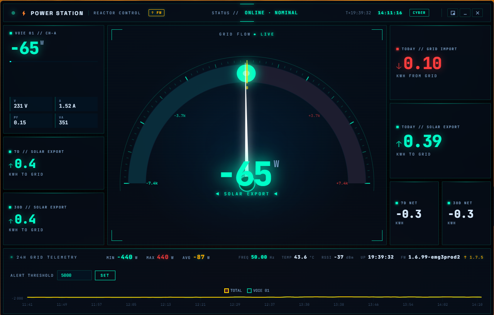
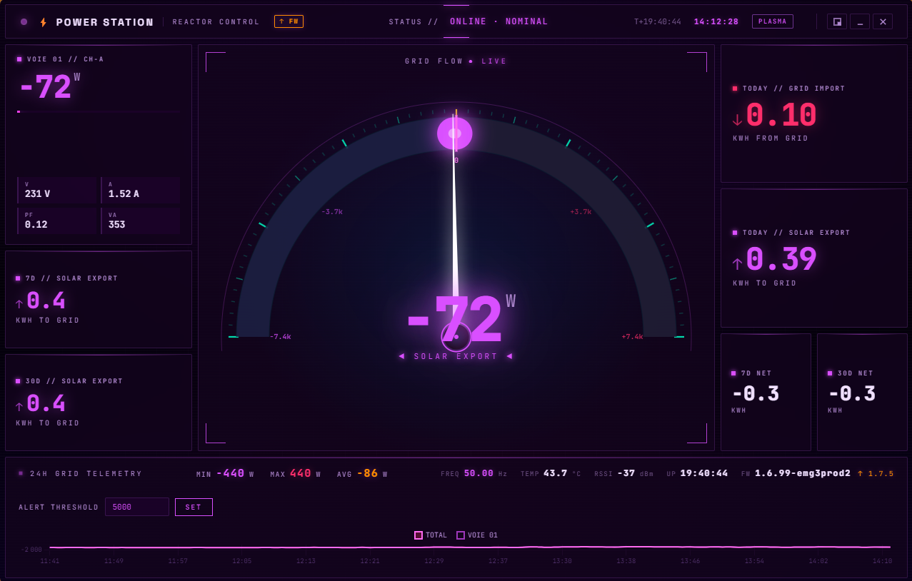
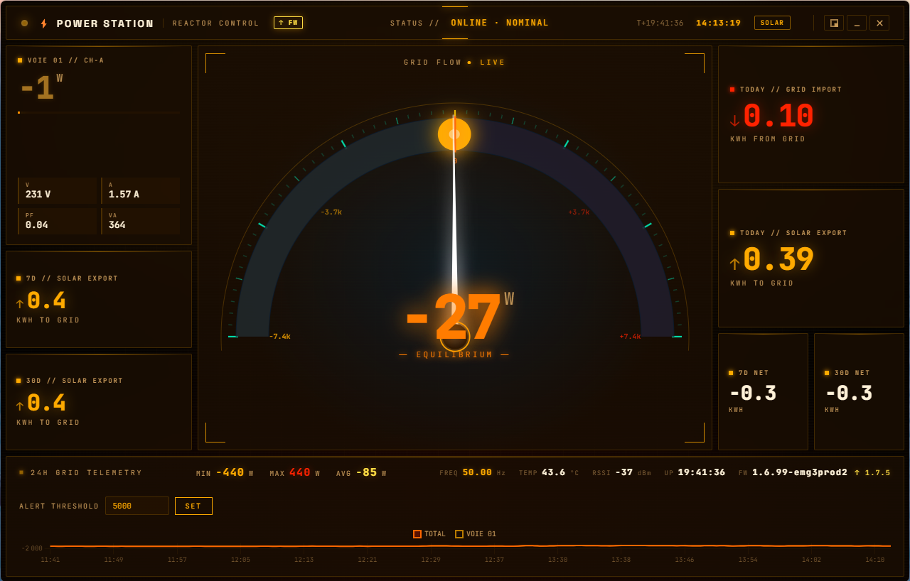
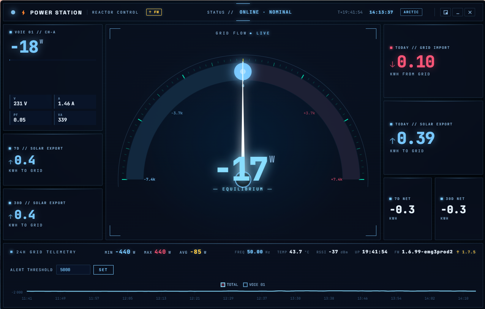
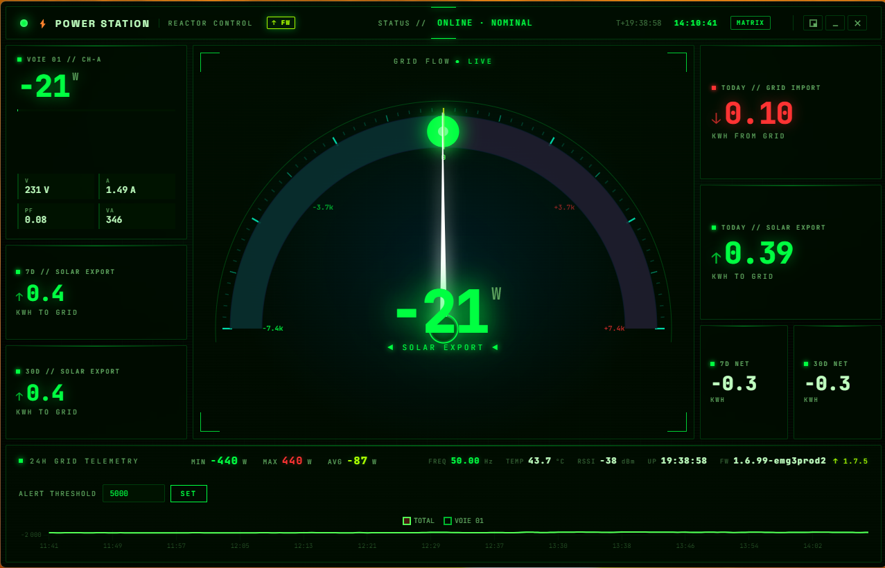

# Power Station — Shelly EM Gen3 Dashboard

Real-time energy monitoring dashboard for **Shelly EM Gen3** (2-channel) devices. Tracks grid import/export with solar panels, displays live power flow with an animated gauge, and stores up to 365 days of history.

  

> **Windows users:** Download the ready-to-run portable `.exe` from the [Releases page](https://github.com/gael-design/shelly-dashboard/releases) — no installation required.

## Screenshots

| Cyber (default) | Plasma | Solar |
|:---:|:---:|:---:|
|  |  |  |

| Arctic | Matrix |
|:---:|:---:|
|  |  |

---

## Table of Contents

- [Features](#features)
- [How It Works](#how-it-works)
- [Prerequisites](#prerequisites)
- [Find Your Shelly IP Address](#find-your-shelly-ip-address)
- [Quick Start — Run in Browser](#quick-start--run-in-browser)
- [Run as Desktop App (Windows)](#run-as-desktop-app-windows)
- [Build a Portable .exe](#build-a-portable-exe)
- [Deploy on Raspberry Pi](#deploy-on-raspberry-pi)
- [Configuration](#configuration)
- [Themes](#themes)
- [Keyboard Shortcuts](#keyboard-shortcuts-electron)
- [API](#api)
- [Shelly Compatibility](#shelly-compatibility)
- [Troubleshooting](#troubleshooting)
- [License](#license)

---

## Features

- **Live power gauge** — Animated canvas gauge with particles, glow effects, and smooth needle interpolation
- **Bi-directional tracking** — Negative watts = solar export, positive = grid import
- **5 color themes** — Cyber, Plasma, Solar, Arctic, Matrix (persisted across sessions)
- **Device health** — Frequency, temperature, WiFi RSSI, uptime, firmware version with update badge
- **Energy stats** — Today/7D/30D import & export from Shelly's native energy counters (Wh)
- **24h telemetry chart** — Min/max/avg power with 1-minute resolution
- **Dual storage** — SQLite (365 days, on Linux/Pi) with JSON fallback (on Windows)
- **Desktop app** — Electron with frameless window, system tray, widget mode (420×460 always-on-top)
- **Pi kiosk** — Runs headless on Raspberry Pi, serves dashboard via Chromium in app mode
- **Auto-migration** — Existing `readings.json` data migrates to SQLite on first run

---

## How It Works

```
Shelly EM Gen3 (WiFi)
       |
       v  HTTP polling (every 2 seconds)
   server.js (Express + WebSocket)
       |
       +---> SQLite / JSON storage (automatic)
       +---> REST API (/api/stats, /api/history, /api/settings)
       +---> WebSocket (live data push to all clients)
       |
       v
   Frontend (browser dashboard)
       |
       +---> Electron app (Windows .exe)
       +---> Chromium kiosk (Raspberry Pi)
       +---> Any browser (http://host:3000)
```

The server polls your Shelly EM device every 2 seconds over your local WiFi network. It reads instantaneous power (watts), voltage, current, frequency, temperature, and energy counters. This data is broadcast to all connected browsers via WebSocket and stored locally for history.

The Windows Electron app tries to connect to a remote Pi server first (for centralized long-term storage), falling back to a local embedded server if unreachable.

---

## Prerequisites

Before starting, make sure you have:

1. **Node.js 18 or newer**
   - Download from [nodejs.org](https://nodejs.org/)
   - Pick the **LTS** version (recommended for most users)
   - Run the installer, accept all defaults
   - To verify: open a terminal and type `node --version` — you should see `v18.x.x` or higher

2. **A Shelly EM Gen3 device**
   - Already installed and connected to your WiFi network
   - If you just unboxed it, use the **Shelly Smart Control** mobile app to connect it to your WiFi first

3. **Your Shelly's IP address** — see the section below

---

## Find Your Shelly IP Address

You need the local IP address of your Shelly device (something like `192.168.1.42` or `10.0.0.22`). Here's how to find it:

### Method 1: Shelly Mobile App (recommended)

1. Install **Shelly Smart Control** from the [App Store](https://apps.apple.com/app/shelly-smart-control/id1234567890) or [Google Play](https://play.google.com/store/apps/details?id=cloud.shelly.smartcontrol)
2. Open the app and make sure your phone is on the **same WiFi network** as the Shelly
3. Your device should appear on the home screen — tap on it
4. Tap the **Settings** icon (gear ⚙️) at the top right
5. Scroll down to **Device Information** (or **Device Info**)
6. Look for **Device IP** — that's the address you need (e.g. `192.168.1.42`)

### Method 2: Router Admin Page

1. Open your router's admin page in a browser (usually `192.168.1.1` or `192.168.0.1` — check the label on your router)
2. Log in with your router credentials
3. Look for **Connected Devices**, **Device List**, or **DHCP Client List**
4. Find the device named **Shelly** or **ShellyEMG3-XXXX**
5. Note its IP address

### Method 3: From a Computer (advanced)

On Windows, open PowerShell and run:
```powershell
# Scan your local network for Shelly devices
1..254 | ForEach-Object { Test-Connection "192.168.1.$_" -Count 1 -Quiet -TimeoutSeconds 1 } 
```
Or use a network scanner app like [Fing](https://www.fing.com/) on your phone.

> **Tip:** Once you find the IP, set a **DHCP reservation** in your router so the Shelly always gets the same address. This prevents the IP from changing after a router reboot.

---

## Quick Start — Run in Browser

This is the simplest way to try the dashboard.

### Step 1: Download the project

```bash
git clone https://github.com/gael-design/shelly-dashboard.git
cd shelly-dashboard
```

Or download the ZIP from GitHub and extract it.

### Step 2: Install dependencies

```bash
npm install
```

This downloads the required Node.js packages. It may take a minute the first time.

### Step 3: Start the server

**On Linux / macOS:**
```bash
SHELLY_IP=192.168.1.42 npm run server
```

**On Windows (PowerShell):**
```powershell
$env:SHELLY_IP="192.168.1.42"
npm run server
```

**On Windows (Command Prompt):**
```cmd
set SHELLY_IP=192.168.1.42
npm run server
```

> Replace `192.168.1.42` with your actual Shelly IP address (see [Find Your Shelly IP Address](#find-your-shelly-ip-address)).

### Step 4: Open the dashboard

Open your browser and go to: **http://localhost:3000**

You should see the Power Station dashboard with live data from your Shelly device. If the gauge shows `---` or no data, double-check the Shelly IP and make sure both your computer and the Shelly are on the same WiFi network.

---

## Run as Desktop App (Windows)

The Electron app gives you a frameless dashboard window with system tray integration, global shortcuts, and a compact widget mode.

```bash
npm install
npm start
```

The app will:
1. Try to connect to a Raspberry Pi server (if you have one — see below)
2. If no Pi is found, start a local server automatically
3. Open the dashboard in a frameless window

### Widget Mode

Right-click the system tray icon → **Mode widget** to switch to a compact 420×460 always-on-top window — perfect for keeping an eye on your power while working.

---

## Download the Portable .exe

A pre-built Windows executable is available on the [Releases page](https://github.com/gael-design/shelly-dashboard/releases). Download `PowerStation-1.0.0-portable.exe` (~70 MB), double-click it, and you're done — no Node.js or installation required.

### Build it yourself

If you prefer to build from source:

```bash
npm install
npm run build
```

The output file will be at `dist/PowerStation-1.0.0-portable.exe`. You can copy this file to any Windows PC and run it directly.

> **Note:** The build may show a `.7z` error at the end — this is a known false positive. Check the `dist/` folder, the `.exe` should be there.

---

## Deploy on Raspberry Pi

Running the server on a Raspberry Pi gives you:
- **24/7 data collection** even when your PC is off
- **SQLite storage** with 365 days of history
- **A dashboard screen** in your living room (optional)

### Step 1: Prepare the Pi

You need a Raspberry Pi (3B+, 4, or 5) with:
- Raspberry Pi OS (Debian-based) installed
- Connected to the same WiFi network as your Shelly device
- SSH access enabled (so you can work from your PC)

Connect via SSH:
```bash
ssh pi@raspberrypi.local
# or use the Pi's IP: ssh pi@192.168.1.XX
```

### Step 2: Install Node.js

```bash
# Install Node.js 18+ via NodeSource
curl -fsSL https://deb.nodesource.com/setup_18.x | sudo -E bash -
sudo apt-get install -y nodejs

# Verify
node --version   # should show v18.x.x or higher
npm --version
```

### Step 3: Copy project files

```bash
mkdir ~/powerstation
cd ~/powerstation
```

Copy these files from the project to the Pi (via `scp`, USB drive, or GitHub):
- `server.js`
- `package.json`
- `public/` folder (entire folder)

Then install dependencies:
```bash
cd ~/powerstation
npm install
```

`better-sqlite3` will compile natively on Linux ARM64 for SQLite support. If it fails, the server falls back to JSON storage automatically — everything still works.

### Step 4: Test it

```bash
SHELLY_IP=192.168.1.42 node server.js
```

Open `http://<Pi-IP>:3000` from any browser on your network. You should see the dashboard with live data. Press `Ctrl+C` to stop.

### Step 5: Set up as a system service

This makes the server start automatically on boot and restart if it crashes:

```bash
sudo tee /etc/systemd/system/powerstation.service << 'EOF'
[Unit]
Description=PowerStation - Shelly EM Gen3 Dashboard
After=network-online.target
Wants=network-online.target

[Service]
Type=simple
User=pi
WorkingDirectory=/home/pi/powerstation
ExecStart=/usr/bin/node server.js
Restart=always
RestartSec=5
Environment=SHELLY_IP=192.168.1.42

[Install]
WantedBy=multi-user.target
EOF

sudo systemctl daemon-reload
sudo systemctl enable --now powerstation
```

> Replace `pi` with your username if different, and `192.168.1.42` with your Shelly IP.

Check the service status:
```bash
sudo systemctl status powerstation
# Should show "active (running)"

# View logs if something goes wrong:
journalctl -u powerstation -f
```

### Step 6: Display on a screen (optional)

To use the Pi as a dedicated dashboard display (living room screen, wall mount, etc.):

```bash
mkdir -p ~/.config/autostart
cat > ~/.config/autostart/powerstation.desktop << 'EOF'
[Desktop Entry]
Type=Application
Name=PowerStation Dashboard
Exec=chromium-browser --app=http://localhost:3000 --start-maximized --no-first-run
X-GNOME-Autostart-enabled=true
EOF
```

This opens Chromium in **app mode** (no address bar, no tabs — looks like a native app) every time the Pi boots into desktop mode.

> **Tip:** For best performance on the Pi, use a small screen (7–10", 800×480 or 1024×600). High-resolution displays may cause the canvas animations to stutter.

### Connect the Windows App to the Pi

Once your Pi server is running, the Windows Electron app will automatically connect to it. Edit the Pi address if needed:

- Default Pi address: `10.0.0.57:3000`
- Change it via environment variables before starting the app:

```powershell
$env:PI_HOST="192.168.1.XX"   # Your Pi's IP
$env:PI_PORT="3000"
npm start
```

When connected to the Pi, the app shows data from the Pi's SQLite database (365 days of history). If the Pi is unreachable, it falls back to a local server with JSON storage.

---

## Configuration

All configuration is via environment variables — no config files to edit:

| Variable | Default | Description |
|----------|---------|-------------|
| `SHELLY_IP` | `10.0.0.22` | IP address of your Shelly EM device |
| `PORT` | `3000` | HTTP server port |
| `PI_HOST` | `10.0.0.57` | Pi server IP (Electron app only) |
| `PI_PORT` | `3000` | Pi server port (Electron app only) |
| `SHELLY_DATA_DIR` | `./` or `%APPDATA%` | Data storage directory |

---

## Themes

Click the **theme button** in the top-right corner of the dashboard to cycle through 5 color themes. Your choice is saved and persists across sessions.

| Theme | Accent | Vibe |
|-------|--------|------|
| **Cyber** | Cyan/Teal | Default sci-fi cockpit |
| **Plasma** | Violet/Magenta | Electric neon |
| **Solar** | Amber/Orange | Fire & energy |
| **Arctic** | Ice Blue/White | Frost terminal |
| **Matrix** | Green | Hacker terminal |

---

## Keyboard Shortcuts (Electron)

| Shortcut | Action |
|----------|--------|
| `Ctrl+Alt+E` | Show/hide the dashboard window |
| `Ctrl+Alt+W` | Toggle widget mode (compact always-on-top) |
| `F5` / `Ctrl+R` | Reload the page |

---

## API

The server exposes a simple REST API and WebSocket for live data:

| Endpoint | Method | Description |
|----------|--------|-------------|
| `/api/stats` | GET | Energy stats — today/week/month import & export (Wh) |
| `/api/history` | GET | 24h power history with 1-minute resolution (min/max/avg) |
| `/api/settings` | GET/POST | Alert threshold configuration |
| `ws://host:3000` | WebSocket | Live power data pushed every 2 seconds |

### Example: Get current stats

```bash
curl http://localhost:3000/api/stats
```

### WebSocket data format

Connect to `ws://localhost:3000` to receive live JSON messages every 2 seconds with current power, voltage, current, power factor, frequency, temperature, and more.

---

## Shelly Compatibility

Tested with **Shelly EM Gen3** (2-channel). The server includes a 3-tier API fallback:

| Device | Generation | Status |
|--------|-----------|--------|
| **Shelly EM Gen3** | Gen3 | Fully tested |
| Shelly Pro 3EM | Gen2 | Supported (3-phase) |
| Shelly EM / EM3 | Gen1 | Supported (legacy API) |

The server automatically detects which API your device supports and adapts accordingly.

---

## Troubleshooting

### The dashboard shows `---` or no data

1. **Check the Shelly IP** — Make sure `SHELLY_IP` matches your device's current IP (see [Find Your Shelly IP Address](#find-your-shelly-ip-address))
2. **Same network?** — Your computer/Pi and the Shelly must be on the same local network
3. **Shelly powered on?** — The Shelly EM needs to be powered via its CT clamps or USB
4. **Firewall?** — Make sure port 80 (Shelly) and port 3000 (dashboard) are not blocked

### The Shelly IP changed

After a router reboot, your Shelly may get a new IP address. To prevent this:
1. Open your router's admin page
2. Find the DHCP reservation (or "static lease") section
3. Add a reservation for your Shelly's MAC address with a fixed IP
4. Update `SHELLY_IP` in your configuration

### The Windows app won't start

- **"Port occupied" error**: Another program is using port 3000. Either close it or set a different port: `$env:PORT="3001"; npm start`
- **App doesn't appear**: Check the system tray (bottom-right of the taskbar) — the app may be hidden there. Click the icon or press `Ctrl+Alt+E`
- **Old version still running**: If you rebuilt the .exe, make sure the old one is fully closed (check Task Manager for `PowerStation.exe`)

### Pi server won't start

```bash
# Check the service status
sudo systemctl status powerstation

# View recent logs
journalctl -u powerstation --since "5 min ago"

# Common fixes:
# 1. Wrong Shelly IP in the service file:
sudo systemctl edit powerstation  # then fix SHELLY_IP
sudo systemctl restart powerstation

# 2. Node.js not found:
which node  # should return /usr/bin/node

# 3. Dependencies not installed:
cd ~/powerstation && npm install
```

### Canvas animations are slow on the Pi

The gauge uses hardware-accelerated canvas with particle effects. On a Pi with a large display, this can be heavy. Solutions:
- Use a smaller screen (800×480 or 1024×600)
- Close other applications on the Pi
- The Pi 5 handles it better than the Pi 4

### SQLite errors on Windows

`better-sqlite3` requires native compilation and may not build on Windows with certain Node.js versions. This is expected — the server automatically falls back to JSON file storage on Windows. All features work the same, just with a simpler storage backend.

---

## License

MIT
